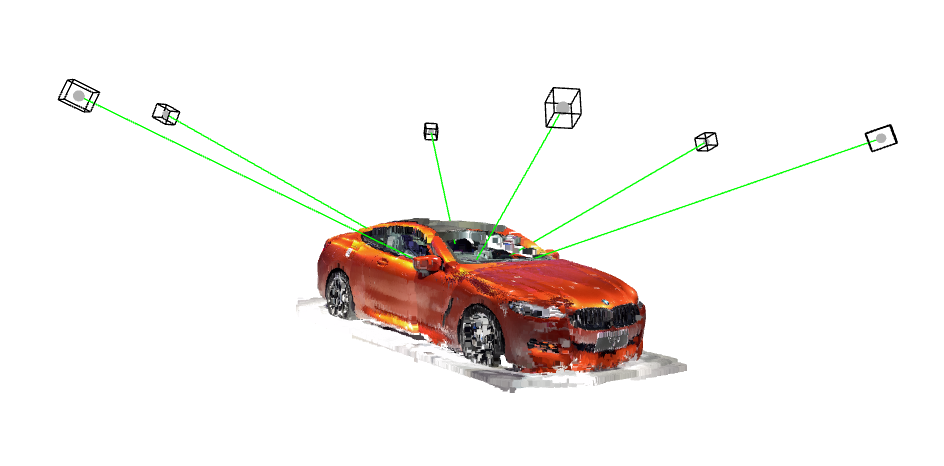
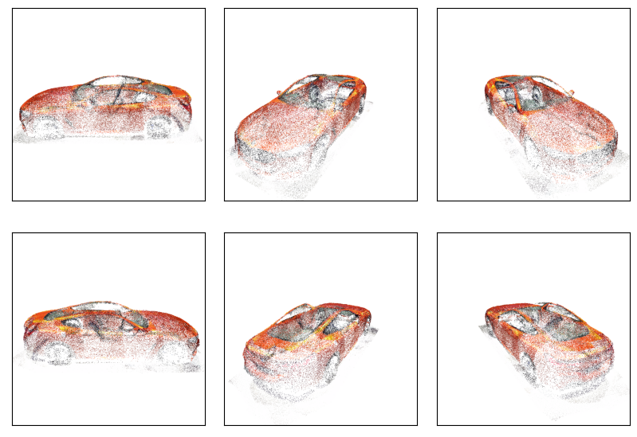
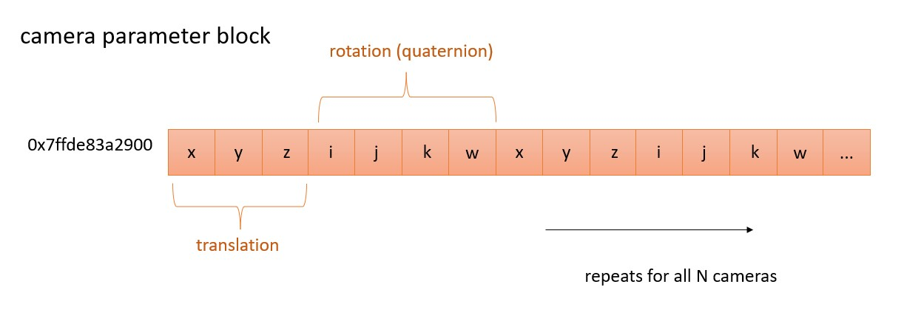

### [Author: John (Jack) Messerly](https://www.linkedin.com/in/jack-messerly-567b9b96/)
### [more of my projects](https://jp-mess.github.io/blog-main/)
### [show me the code!](https://github.com/jp-mess/ceres-geometric-constraints)

<br>
<br>  

<p align="center">
  
</p>


<br>
<br>

# What is a geometric constraint?

Structure-from-motion is the most commonly used pipeline for creating 3D models from 2D images. Image feature-matches are fed into an optimization algorithm known as Bundle Adjustment, which simultaneously estimates the positions of the cameras, as well as a 3D point cloud of all the matched pixels. I assume if the reader has found this page, they know that much. The diagram at the top of this page depicts the entire output of Bundle Adjustment, with the estimated position of 6 cameras, as well as the reconstructed object (a red car). Each camera in this simulation has a focal length of 525, and an image dimension of 600x600. Below are six images, rendered from each camera's orientation. The green lines indicate the camera's viewing direction.

<br>

<p align="center">
  
</p>

<br>


What if we know (beforehand) that all the cameras in this system lie on a ring, like in the diagram above? This is what I would call a "geometric prior", and in real-world applications this is a common scenario because the cameras will be on some sort of rig (or robot). Can we use these assumptions to make the optimization more efficient? The answer is yes, and it isn't difficult to setup in ceres. Any relative geometric constraint imposed on the cameras can be implemented as a reparameterization, and it generally makes the optimization more efficient if you have a reasonable prior estimate of that geometry (i.e. you know the ring should be roughly horizontal and above the car, not below it). Instead of learning all of the 3D positions of the cameras independently, ceres can learn the 6 parameters for the 3D ring, and then for each camera, simply learn the angle of the ring that each camera falls on. This trick can also work for:

1. Planes, lines, or other geometric shapes with a small number of parameters
2. Relative distances (enforce all cameras to be the same distance away)

Below is a visualization of what this means; in addition to the rough positions of the cameras, we have a rough idea of what kind of ring the cameras will fall on. Bundle Adjustment can solve for both simultaneously.

<p align="center">
  
</p>

<br>
<br>

# Reprojection Error and Parameter Blocks in Ceres

I assume the reader is familiar with textbook Bundle Adjustment and nonlinear least-squares. I've added a section here which goes over how to build a cost function and set parameter blocks in ceres, since these are the things that will be modified to implement geometry constraints. Ceres will store the parameters you want to estimate in "parameter blocks", which are pointers to contiguous places in memory where those parameters are. I've illustrated the parameter block for the extrinsic parameters in the system. In thoe code, I've added these as a `camera_manifold`, so that the quaternions can be estimated more efficiently. The world points are in a secondary block, and the intrinsic parameters are in a third. You can see in the code that I've frozen the intrinsic parameters.

<p align="center">
  
</p>

## Some Boring Parameter Blocks

```bash
for (int i = 0; i < quat_problem.num_observations(); ++i) {
        ceres::CostFunction* cost_function = QuatCost::Create(
            observations[2 * i + 0], observations[2 * i + 1]);

        // Get the entire camera parameter block (which includes quaternion, translation, and intrinsics)
        double* extrinsics = quat_problem.mutable_extrinsic_for_observation(i);
        double* intrinsics = quat_problem.mutable_intrinsic_for_observation(i);
        double* point = quat_problem.mutable_point_for_observation(i);


        ceres::Manifold* camera_manifold = new ceres::ProductManifold<ceres::QuaternionManifold, ceres::EuclideanManifold<3>>{};

        problem.AddParameterBlock(intrinsics, 3);
        problem.SetParameterBlockConstant(intrinsics);

        problem.AddParameterBlock(extrinsics, 7, camera_manifold);

        // Add the residual block to the problem.
        problem.AddResidualBlock(cost_function, nullptr /* squared loss */, extrinsics, intrinsics, point);

```

## A Boring Cost Function (reprojection error)

A reminder that the pose matrix of a camera rotates a point from the camera's optical frame, to the world frame, so an inverse is needed for reprojection error.

```bash
 template <typename T>
  bool operator()(const T* const extrinsic_params, // Camera parameters
                  const T* const intrinsic_params, // frozen intrinsics
                  const T* const point,  // 3D point
                  T* residuals) const {

    // Camera parameters: quaternion (4), translation (3), intrinsics (3)
    const T* quaternion = extrinsic_params;
    const T* translation = extrinsic_params + 4;
    const T* intrinsics = intrinsic_params;

    // Conjugate of the quaternion for inverse rotation.
    // Eigen uses x,y,z,w format when loading in quaternions this way
    T conjugate_quaternion[4] = {quaternion[0], 
                                 -quaternion[1], 
                                 -quaternion[2], 
                                 -quaternion[3]};

    // Apply inverse translation: point - translation.
    T translated_point[3] = {point[0] - translation[0],
                             point[1] - translation[1],
                             point[2] - translation[2]};


    // Rotate the translated point using the conjugate of the camera quaternion.
    T rotated_translated_point[3];
    ceres::QuaternionRotatePoint(conjugate_quaternion, translated_point, rotated_translated_point);

    // Project the 3D point onto the 2D camera plane.
    const T& focal = intrinsics[0];
    const T& cx = intrinsics[1];
    const T& cy = intrinsics[2];

    const T kEpsilon = T(1e-4);
    const T xp = rotated_translated_point[0] / (rotated_translated_point[2] + kEpsilon);
    const T yp = rotated_translated_point[1] / (rotated_translated_point[2] + kEpsilon);

    const T predicted_x = focal * xp + cx;
    const T predicted_y = focal * yp + cy;

    // The error is the difference between the predicted and observed positions.
    residuals[0] = predicted_x - observed_x;
    residuals[1] = predicted_y - observed_y;

```


<br>
<br>

# Ring Constraints


To implement a ring constraint


