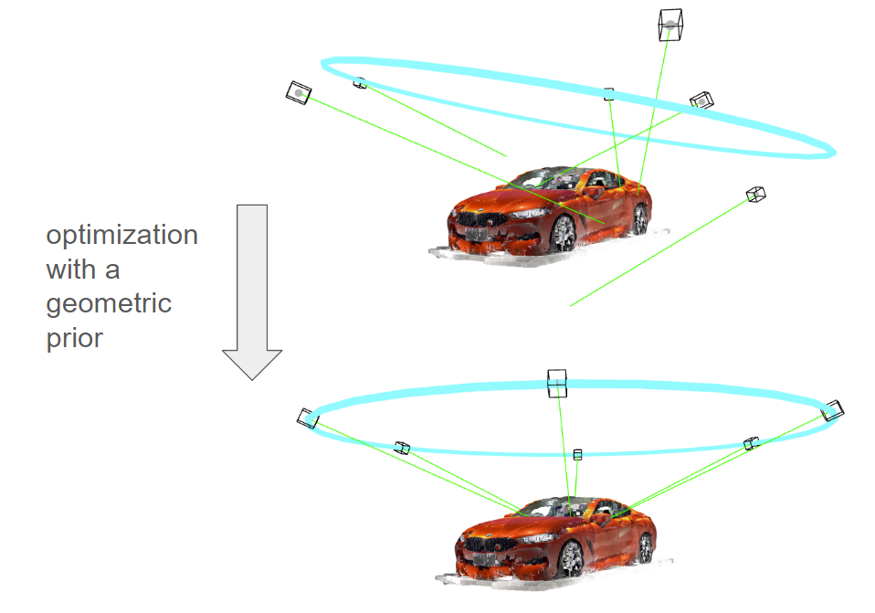
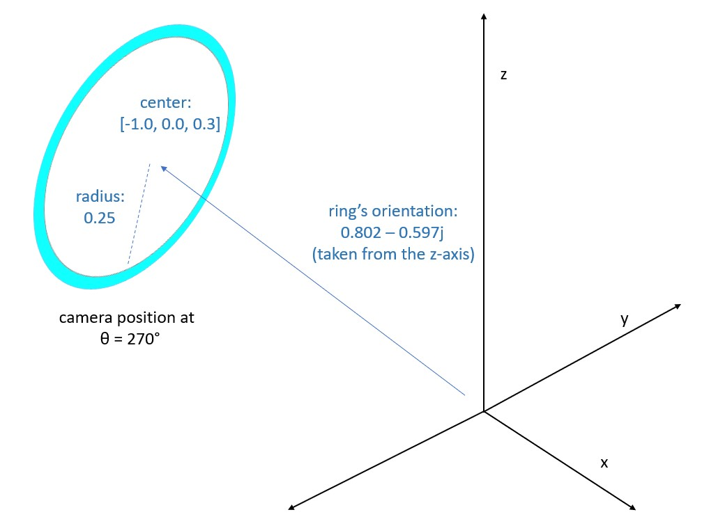
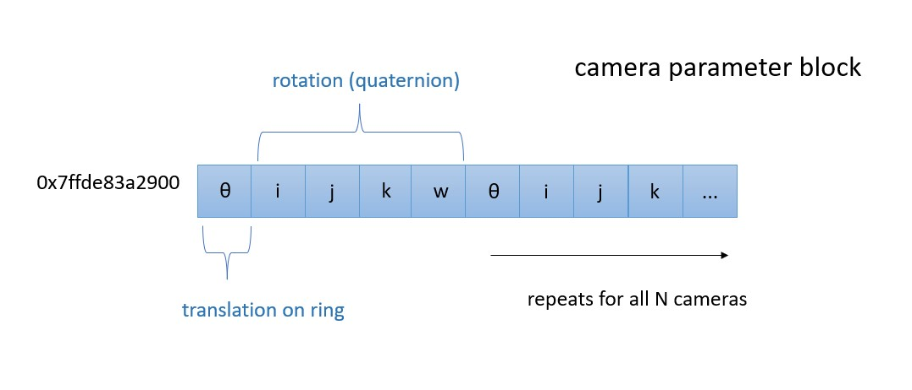
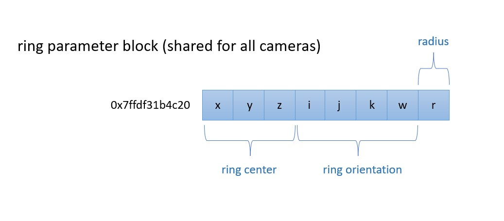

### [Author: John (Jack) Messerly](https://www.linkedin.com/in/jack-messerly-567b9b96/)
### [more of my projects](https://jp-mess.github.io/blog-main/)
### [show me the code!](https://github.com/jp-mess/ceres-geometric-constraints)

<br>
<br>  

<p align="center">
  
</p>

<br>


# What is a geometric prior?

**First, the briefest review of 3D computer vision:** Structure-from-motion is the most commonly used pipeline for creating 3D models from 2D images. In structure-from-motion, images (and their feature matches) are fed into an optimization algorithm known as Bundle Adjustment, which simultaneously estimates the positions of the cameras, as well as a 3D point cloud of all the matched pixels. The diagram at the top of this page depicts the entire output of a simulated Bundle Adjustment, with the estimated position of 6 cameras, as well as the reconstructed object (a red car). Each camera in this simulation has a focal length of 525, and an image dimension of 600x600. The green lines indicate the camera's viewing direction. Below are the 6 images that were taken by these 6 cameras, and then used to reconstruct the car in the above diagram:

<br>

<p align="center">
  
</p>

<br>


**Geometric Priors:** What if we know (beforehand) that all the cameras in this system lie on a ring, like in the diagram above? Could we use that information be helpful in estimating the positions of the 6 cameras? This is what I would call a "geometric prior", and in real-world applications this is a common scenario because the cameras will be on some sort of rig (or robot). It could also be called a "geometric constraint", but that would imply it makes the optimization more difficult, when in reality it makes it easier. Any relative geometric constraint imposed on the cameras can be implemented as a reparameterization, and it generally makes the optimization more efficient if you have a reasonable prior estimate of that geometry (i.e. you know the ring should be roughly horizontal and above the car, not below it). Instead of learning all of the 3D positions of the cameras independently, ceres can learn the 6 parameters for the 3D ring, and then for each camera, simply learn the angle of the ring that each camera falls on. This trick can also work for:

1. Planes, lines, or other geometric shapes with a small number of parameters
2. Relative distances (enforce all cameras to be the same distance away)

Below is a visualization of what this means; in addition to the rough positions of the cameras, we have a rough idea of what kind of ring the cameras will fall on. Bundle Adjustment can solve for both simultaneously.

<p align="center">
  
</p>

<br>
<br>

# Setting up a basic bundle adjustment problem

I assume the reader is familiar with textbook Bundle Adjustment and nonlinear least-squares. I've added a section here which goes over how to build a cost function and set parameter blocks in ceres, since these are the things that will be modified to implement geometry constraints. Ceres will store the parameters you want to estimate in "parameter blocks", which are pointers to contiguous places in memory where those parameters are. I've illustrated the parameter block for the extrinsic parameters in the system. In thoe code, I've added these as a `camera_manifold`, so that the quaternions can be estimated more efficiently. The world points are in a secondary block, and the intrinsic parameters are in a third. You can see in the code that I've frozen the intrinsic parameters.

<br>

<p align="center">
  
</p>

<br>

## Some basic parameter blocks


```cpp
for (int i = 0; i < quat_problem.num_observations(); ++i) {
  ceres::CostFunction* cost_function = QuatCost::Create(observations[2 * i + 0], observations[2 * i + 1]);
  
  // Get the entire camera parameter block (which includes quaternion, translation, and intrinsics)
  double* extrinsics = quat_problem.mutable_extrinsic_for_observation(i);
  double* intrinsics = quat_problem.mutable_intrinsic_for_observation(i);
  double* point = quat_problem.mutable_point_for_observation(i);

  ceres::Manifold* camera_manifold = new ceres::ProductManifold<ceres::QuaternionManifold, ceres::EuclideanManifold<3>>{};

  problem.AddParameterBlock(intrinsics, 3);
  problem.SetParameterBlockConstant(intrinsics);

  problem.AddParameterBlock(extrinsics, 7, camera_manifold);

  // Add the residual block to the problem.
  problem.AddResidualBlock(cost_function, nullptr /* squared loss */, extrinsics, intrinsics, point);
}
```

<br>

## A basic cost function (reprojection error)

A reminder that the pose matrix of a camera rotates a point from the camera's optical frame, to the world frame, so an inverse is needed for reprojection error.

```cpp
template <typename T>
bool operator()(const T* const extrinsic_params, // Camera parameters
                const T* const intrinsic_params, // frozen intrinsics
                const T* const point,  // 3D point
                T* residuals) const {

  // Camera parameters: quaternion (4), translation (3), intrinsics (3)
  const T* quaternion = extrinsic_params;
  const T* translation = extrinsic_params + 4;
  const T* intrinsics = intrinsic_params;

  // Conjugate of the quaternion for inverse rotation.
  // Eigen uses x,y,z,w format when loading in quaternions this way
  T conjugate_quaternion[4] = {quaternion[0], 
                               -quaternion[1], 
                               -quaternion[2], 
                               -quaternion[3]};

  // Apply inverse translation: point - translation.
  T translated_point[3] = {point[0] - translation[0],
                           point[1] - translation[1],
                           point[2] - translation[2]};


  // Rotate the translated point using the conjugate of the camera quaternion.
  T rotated_translated_point[3];
  ceres::QuaternionRotatePoint(conjugate_quaternion, translated_point, rotated_translated_point);

  // Project the 3D point onto the 2D camera plane.
  const T& focal = intrinsics[0];
  const T& cx = intrinsics[1];
  const T& cy = intrinsics[2];

  const T kEpsilon = T(1e-4);
  const T xp = rotated_translated_point[0] / (rotated_translated_point[2] + kEpsilon);
  const T yp = rotated_translated_point[1] / (rotated_translated_point[2] + kEpsilon);

  const T predicted_x = focal * xp + cx;
  const T predicted_y = focal * yp + cy;

  // The error is the difference between the predicted and observed positions.
  residuals[0] = predicted_x - observed_x;
  residuals[1] = predicted_y - observed_y;
}
```

<br>
<br>


# Adding a "ring" geometric prior

To implement ring constraints, we don't need to adjust the cost function at all. Instead, we update what's stored in the parameter blocks, and how we take the reprojection error. The full 3D [x, y, z] point in each camera is replaced by a single `theta` parameter, because each camera's 3D position can be reduced to the angle at which it lives on the ring. This means we have to update our code to include functions that project 3D points to the ring, and vice versa. We also add some parameter blocks for the 8 total ring parameters (the ring's center point, its quaternion orientation, and its radius), and estimate those simultaneously with the camera positions (represented by a `theta` for the translation, and a quaternion for the orientation), as well as the 3D world points. In theory, we've reduced our workload. In the above basic example, we had 6 x 10 = 60 total camera parameters, whereas now we have (6 x 5) + 8 = 38 total camera parameters.

<br>

<p align="center">
  
</p>

<br>

<p align="center">
  
</p>

<br>

<p align="center">
  
</p>

<br>
<br>

## Projecting a 3D point to an angle on the ring

This will be used to initialize the problem (we want to project our initial 3D points onto a ring, so that we can change the parameter blocks).

```cpp
double ProjectPointOntoRing(const Eigen::Vector3d& point, 
                            const Eigen::Vector3d& center, 
                            const Eigen::Quaterniond& ring_orientation) {
    // Step 1: Translate the point to the ring's coordinate system
    Eigen::Vector3d translated_point = point - center;

    // Step 2: Rotate the translated point to align with the ring's local coordinate system
    // Inverse rotation is used to bring the point into the ring's coordinate frame
    Eigen::Quaterniond inverse_orientation = ring_orientation.conjugate();
    Eigen::Vector3d aligned_point = inverse_orientation * translated_point;

    // Step 3: Since the ring lies in the XY plane of its local coordinate system,
    // the Z-component of aligned_point can be ignored for theta calculation.
    // Compute the angle between the X-axis and the projected point in the XY plane
    double theta = atan2(aligned_point.y(), aligned_point.x());

    return theta;
}
```

<br>

## Converting an angle back to a 3D point

I've made this one templated because it actually has to be used in the ceres cost function (ceres will guess a `theta`, then to take a reprojection error, we need to extract the pose matrix).

```cpp
template <typename T>
Eigen::Matrix<T, 3, 1> ThetaTo3DPoint(const T& theta, 
                                      const Eigen::Matrix<T, 3, 1>& center, 
                                      const Eigen::Quaternion<T>& ring_orientation, 
                                      const T& radius) {
    // Step 1: Calculate the point's position in the ring's local XY plane
    Eigen::Matrix<T, 3, 1> point_in_plane(radius * cos(theta), radius * sin(theta), T(0));

    // Step 2: Rotate the point from the ring's local coordinate system to the global coordinate system
    Eigen::Matrix<T, 3, 1> point_in_global_space = ring_orientation * point_in_plane;

    // Step 3: Translate the point by the ring's center to get its position in the original coordinate system
    Eigen::Matrix<T, 3, 1> point_in_original_space = point_in_global_space + center;

    return point_in_original_space;
}
```

<br>

## Updated parameter blocks for the ring

```cpp
for (int i = 0; i < ring_problem.num_observations(); ++i) {
    ceres::CostFunction* cost_function = RingCost::Create(
        observations[2 * i + 0], observations[2 * i + 1]);

    // Get camera parameters and point for this observation
    double* extrinsics = ring_problem.mutable_extrinsic_for_observation(i);
    double* intrinsics = ring_problem.mutable_intrinsic_for_observation(i);
    double* point = ring_problem.mutable_point_for_observation(i);
    double* geometry = ring_problem.mutable_geometry_params();

    // Use a product manifold of AngleManifold (for theta) and QuaternionManifold (for the quaternion)
    ceres::Manifold* camera_manifold = new ceres::ProductManifold<ceres::AutoDiffManifold<AngleManifold, 1, 1>, ceres::QuaternionManifold>{};

    problem.AddParameterBlock(intrinsics, 3);
    problem.SetParameterBlockConstant(intrinsics);

    ceres::Manifold* ring_manifold = new ceres::ProductManifold<ceres::EuclideanManifold<3>, ceres::QuaternionManifold, ceres::EuclideanManifold<1>>{};

    problem.AddParameterBlock(geometry, 8, ring_manifold);

    // Assuming camera has 5 parameters (1 for theta, 4 for quaternion)
    // problem.AddParameterBlock(extrinsics, 5, camera_manifold);
    problem.AddParameterBlock(extrinsics, 5);

    // Add the residual block to the problem
    problem.AddResidualBlock(cost_function, nullptr /* squared loss */, extrinsics, intrinsics, point, geometry);
}
```

<br>

## A ring coordinate reprojection error function

```cpp
template <typename T>
bool operator()(const T* const extrinsic_params, // Camera parameters
                const T* const intrinsic_params, // frozen intrinsics
                const T* const point,  // 3D point
                const T* const ring_params, // Ring parameters
                T* residuals) const {

    // Camera parameters: quaternion (4), theta (1), intrinsics (3)
    const T* camera_quaternion = extrinsic_params;
    const T& theta = extrinsic_params[4];  // Theta is the fifth parameter
    const T* intrinsics = intrinsic_params;

    // Conjugate of the camera quaternion for inverse rotation.
    T conjugate_camera_quaternion[4] = {camera_quaternion[0], 
                                        -camera_quaternion[1], 
                                        -camera_quaternion[2], 
                                        -camera_quaternion[3]};

    // Extract the ring parameters: center (3), orientation quaternion (4), radius (1)
    Eigen::Matrix<T, 3, 1> center;
    Eigen::Quaternion<T> ring_orientation;
    center << ring_params[0], ring_params[1], ring_params[2];
    // Eigen uses x,y,z,w format when loading in quaternions this way (it's the API that is wrong)
    ring_orientation.coeffs() << ring_params[3], ring_params[4], ring_params[5], ring_params[6];
    const T& radius = ring_params[7];

    // Convert theta back to translation
    Eigen::Matrix<T, 3, 1> translation = ThetaTo3DPoint(theta, center, ring_orientation, radius);

    // Apply inverse translation: point - translation.
    T translated_point[3] = {point[0] - translation[0],
                             point[1] - translation[1],
                             point[2] - translation[2]};

    // Rotate the translated point using the conjugate of the camera quaternion.
    T rotated_translated_point[3];
    ceres::QuaternionRotatePoint(conjugate_camera_quaternion, translated_point, rotated_translated_point);

    // Project the 3D point onto the 2D camera plane.
    const T& focal = intrinsics[0];
    const T& cx = intrinsics[1];
    const T& cy = intrinsics[2];

    const T kEpsilon = T(1e-4);
    const T xp = rotated_translated_point[0] / (rotated_translated_point[2] + kEpsilon);
    const T yp = rotated_translated_point[1] / (rotated_translated_point[2] + kEpsilon);

    const T predicted_x = focal * xp + cx;
    const T predicted_y = focal * yp + cy;

    // The error is the difference between the predicted and observed positions.
    residuals[0] = predicted_x - observed_x;
    residuals[1] = predicted_y - observed_y;

    return true;
}
```

<br>
<br>

# Results analysis 


