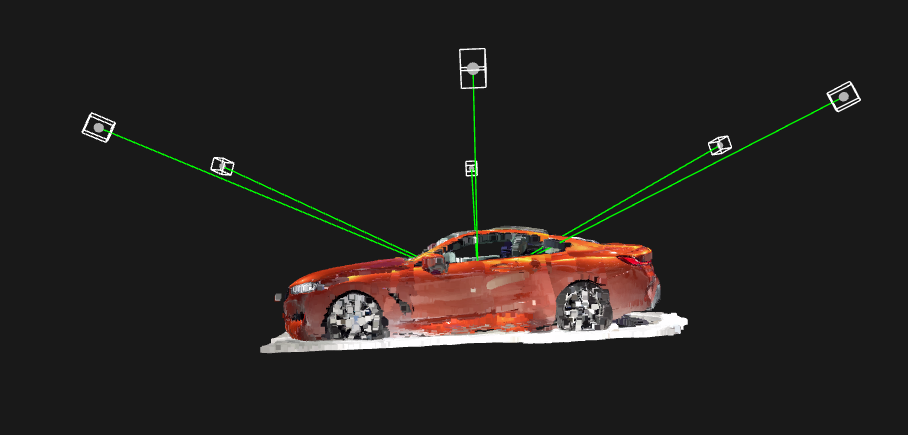

  

 
 

# What is a Relative Geometry Constraint?

Structure-from-motion is the most commonly used pipeline for creating 3D models from 2D images. Image feature-matches are fed into an optimization algorithm known as Bundle Adjustment, which simultaneously estimates the positions of the cameras, as well as a 3D point cloud of all the matched pixels. The diagram at the top of this page depicts the entire output of Bundle Adjustment, with the estimated position of 6 cameras, as well as the reconstructed object (a red car). Each camera in this simulation has a focal length of 525, and an image dimension of 600x600. Below are six images, rendered from each camera's orientation. The green lines indicate the camera's viewing direction.

 

  

 

You'll notice that the cameras in this picture are all in a ring. Indeed, they were sampled that way. If I had known that they would fall in a ring before my optimization, could I have made my optimization more efficient? The answer is yes, and it isn't difficult to setup in ceres, because they are all "relative geometry constraints". Any relative geometric constraint imposed on the cameras can be implemented as a reparameterization. Instead of learning all of the 3D positions of the cameras independently, ceres can learn the 6 parameters for the 3D ring, and then for each camera, simply learn the angle of the ring that each camera falls on. This trick can also work for:

1. Planes, lines, or other geometric shapes with a small number of parameters
2. Relative distances (enforce all cameras to be the same distance away)

You cannot, however, enforce "inequality" constraints this way. You'd need to modify the optimizer itself for that, which is not easy in ceres.

 
 

## Mathematical Formulation of Bundle Adjustment

Bundle adjustment is an optimization problem at its core, aiming to refine the 3D coordinates of the feature points and the camera parameters by minimizing the reprojection error. The problem can be formulated as a nonlinear least squares problem:

Given:
- A set of observed feature points in images, $\mathbf{x}_{ij}$, where $i$ indexes the image and $j$ indexes the point.
- The corresponding 3D coordinates of the feature points in the scene, $\mathbf{X}_j$.
- The camera parameters for each image, $\mathbf{p}_i$, which may include the camera position, orientation, focal length, and lens distortion parameters.

We seek to minimize the sum of squared reprojection errors across all feature points and all images:

$$
\min_{\mathbf{X}, \mathbf{p}} \sum_{i=1}^{n} \sum_{j=1}^{m} \rho \left( \mathbf{r}_{ij}(\mathbf{X}_j, \mathbf{p}_i) \right)
$$

where:
- $\mathbf{r}_{ij}(\mathbf{X}_j, \mathbf{p}_i)$ is the reprojection error for feature point $j$ in image $i$.
- $\rho$ is a robust cost function, such as the Huber loss, which reduces the influence of outliers.
- $n$ is the number of images.
- $m$ is the number of feature points.

The reprojection error $\mathbf{r}\_{ij}$ is defined as the difference between the observed feature point location $\mathbf{x}\_{ij}$ and the projected location of the 3D point $\mathbf{X}\_j$ using the camera parameters $\mathbf{p}\_i$:

$$
\mathbf{r}_{ij}(\mathbf{X}_j, \mathbf{p}_i) = \mathbf{x}_{ij} - \text{project}(\mathbf{X}_j, \mathbf{p}_i)
$$

The `project` function applies the camera model, including intrinsic and extrinsic parameters, to map 3D points to 2D image coordinates.

The Levenberg-Marquardt algorithm is often used to solve this optimization problem due to its effectiveness in dealing with nonlinear least squares.

